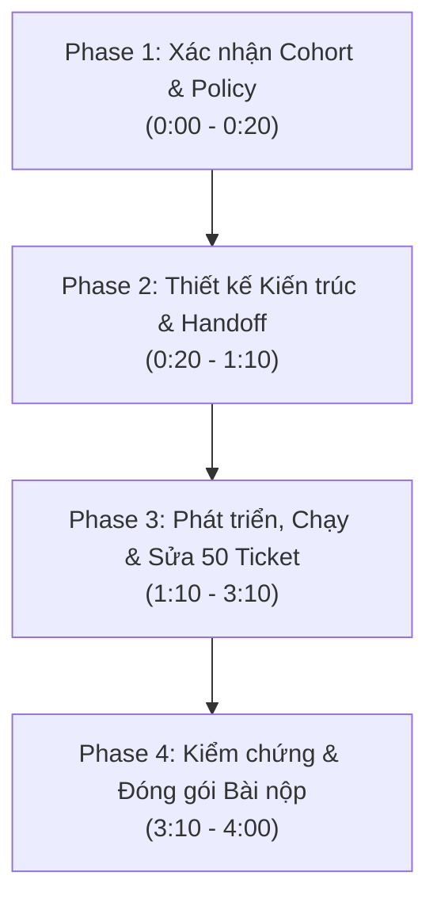

# Hướng dẫn Thực thi & Lộ trình Bài Lab — Day 09: Multi-Agent E-commerce Dispute Resolution

## 1. Thông tin sinh viên & Cohort
* **Họ và tên**: Nguyễn Tuấn Vũ
* **Mã sinh viên**: 2A202601845
* **Cohort**: **K3**
* **Repo**: `DAY09_2A202601845_NguyenTuanVu` (K3-Day9-Multi-Agent-A2A)
* **Chính sách (Policy)**: `EC_POLICY_V1`

---

## 2. Tổng quan Bài lab
Xây dựng và kiểm chứng hệ thống **Multi-Agent** tự động điều tra 50 khiếu nại của khách hàng trên dữ liệu Olist E-commerce (Brazil). 

### Nguyên tắc cốt lõi:
1. **Multi-agent phân vai chuyên trách**: Phân chia nhiệm vụ theo nguồn dữ liệu (Order/Seller, Payment, Delivery, Policy, Verifier, Coordinator).
2. **Grounding bằng Evidence ID**: Mọi kết luận, khoản hoàn tiền phải được truy vết trực tiếp bằng ID có thật từ dữ liệu (không suy đoán, không hallucinate).
3. **Structured Handoff**: Gói thông tin truyền giữa các agent chứa Ticket ID, Fact đã kiểm chứng, Fact còn thiếu, và khuyến nghị cho agent tiếp theo.
4. **Verifier Agent & Policy Enforcement**: Kiểm tra tính hợp lệ của Evidence ID, Schema, và logic tính toán tiền/hoàn tiền theo đúng `EC_POLICY_V1`.
5. **Giới hạn Mô hình**: Mỗi agent chỉ sử dụng LLM **<= 10B parameters**. Tuyệt đối không commit API key, token, hay file `.env`.

---

## 3. Bản đồ Lộ trình Thực hiện (Lab Schedule — 240 phút)



---

### Phase 1: Xác nhận Cohort & Nguyên tắc (0:00–0:20)
- [x] Xác nhận thông tin sinh viên: **Nguyễn Tuấn Vũ - 2A202601845 - K3**.
- [x] Xác nhận policy: `EC_POLICY_V1` (gồm 6 primary issues).
- [ ] Kiểm tra nguồn dữ liệu Olist (`data/` đầy đủ 9 file CSV).
- [ ] Kiểm tra 50 ticket khiếu nại đầu vào (`input/EC_001.json` ... `EC_050.json`).

---

### Phase 2: Thiết kế Agent Architecture & Handoff (0:20–1:10)
Xây dựng sơ đồ phân vai và luồng trao đổi dữ liệu:

1. **Coordinator Agent**:
   - Nhận ticket (`claimed_order_id`, `message`, `opened_at`).
   - Khởi tạo công việc, phân phối cho các sub-agent chuyên trách và tổng hợp kết quả cuối cùng.
2. **Order & Seller Agent**:
   - Đọc `olist_orders_dataset.csv`, `olist_order_items_dataset.csv`, `olist_sellers_dataset.csv`.
   - Kiểm tra `order_status`, các items, sellers, và mốc bàn giao `shipping_limit_date`.
3. **Payment Agent**:
   - Đọc `olist_order_payments_dataset.csv`.
   - Tính tổng tiền `payment_total_brl`, kiểm tra các dòng payment row và đối soát với tổng item + freight.
4. **Delivery Agent**:
   - Đọc timestamp `order_delivered_carrier_date`, `order_delivered_customer_date`, `order_estimated_delivery_date`.
   - So sánh mốc thời gian thực tế với hạn cam kết giao hàng.
5. **Policy Agent**:
   - Áp dụng `EC_POLICY_V1` để phân loại nguyên nhân chính (`primary_issue`), bên chịu trách nhiệm (`responsible_party`), khoản hoàn tiền (`refund`), và hành động (`action`).
6. **Verifier Agent**:
   - Thẩm định lại toàn bộ output: Kiểm tra sự tồn tại của `evidence_ids` trong CSV, kiểm tra schema output JSON, làm tròn tiền 2 chữ số thập phân, đảm bảo số lượng các entity không vượt quá giới hạn.

---

### Phase 3: Phát triển Pipeline & Chạy 50 Ticket (1:10–3:10)
- [ ] Xây dựng Data Access / Retrieval Layer cho các file CSV của Olist.
- [ ] Viết Python Pipeline triển khai các Agent và luồng Handoff (`handoff_packet`).
- [ ] Chạy thử nghiệm trên 1 ticket mẫu (`EC_001.json`), validate qua Verifier Agent.
- [ ] Chạy tự động batch 50 ticket (`EC_001.json` -> `EC_050.json`).
- [ ] Ghi lại lịch sử thực thi vào `trace.jsonl`.
- [ ] Sửa lỗi hệ thống tại gốc (Agent/Prompt/Logic Router) nếu ticket bị lỗi.

---

### Phase 4: Kiểm chứng, Tạo Báo cáo & Đóng gói (3:10–4:00)
- [ ] **Kiểm tra Output**: Đảm bảo đúng 50 file JSON trong `output/`, đặt đúng tên `EC_001.json` -> `EC_050.json`.
- [ ] **Hoàn thiện `architecture.md`**: Ghi rõ sơ đồ Agent, vai trò, quyền truy cập và luồng handoff.
- [ ] **Hoàn thiện `logging/metadata.json`**:
  ```json
  {
    "cohort": "K3",
    "policy_version": "EC_POLICY_V1",
    "model_name": "<Tên model <= 10B>",
    "framework": "<Framework sử dụng>",
    "runtime": "<Thông tin runtime>"
  }
  ```
- [ ] **Báo cáo cá nhân**: Đổi tên `individual_5SoCuoiMHV_HoVaTen.md` thành `individual_01845_NguyenTuanVu.md` và cập nhật thông tin cá nhân.
- [ ] **Tạo file ZIP nộp bài**: Nén thư mục `output/` thành file zip nộp cho giảng viên/hệ thống.

---

## 4. Bảng Quy tắc Nghiệp vụ (EC_POLICY_V1 — K3)

| Primary issue | Điều kiện logic | Responsible party | Refund | Action | Root Cause Code |
| :--- | :--- | :--- | :--- | :--- | :--- |
| `canceled_order_paid` | `order_status = canceled` & tổng payment > 0 | `platform` (`OLIST_PLATFORM`) | Tổng payment | `issue_full_refund` | `ORDER_CANCELED_AFTER_PAYMENT` |
| `unavailable_order_paid` | `order_status = unavailable` & tổng payment > 0 | `platform` (`OLIST_PLATFORM`) | Tổng payment | `issue_full_refund` | `ORDER_UNAVAILABLE_AFTER_PAYMENT` |
| `late_delivery_seller` | Giao sau `estimated_date` & carrier nhận hàng sau `shipping_limit_date` | `seller` (Seller ID) | Tổng freight | `refund_freight` | `SELLER_HANDOFF_AFTER_LIMIT` |
| `late_delivery_logistics` | Giao sau `estimated_date` & carrier nhận hàng <= `shipping_limit_date` | `logistics_provider` | Tổng freight | `refund_freight` | `CARRIER_DELIVERED_AFTER_ESTIMATE` |
| `valid_split_payment` | Có >= 2 payment rows; tổng payment khớp tổng (item + freight) trong sai số 0.10 BRL | Không có | 0 | `explain_valid_split_payment` | `MULTIPLE_PAYMENTS_RECONCILED` |
| `unsupported_late_claim` | Giao không muộn hơn `estimated_date` & payment khớp | Không có | 0 | `reject_late_refund` | `DELIVERY_WITHIN_ESTIMATE` |

---

## 5. Định dạng Evidence ID hợp lệ (K3)
Chỉ được tạo Evidence ID trực tiếp từ dữ liệu:
* `order:<order_id>`
* `item:<order_id>:<order_item_id>`
* `payment:<order_id>:<payment_sequential>`
* `seller:<seller_id>`
* `policy:<root_cause_code>`
