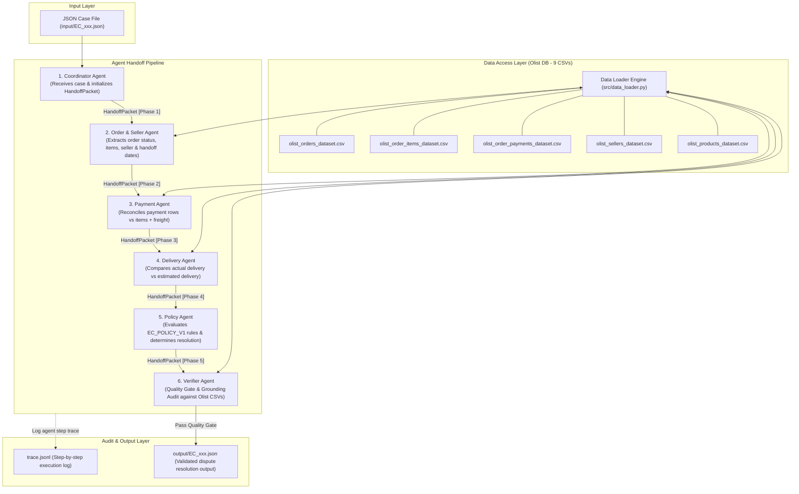

# Architecture Specification: Multi-Agent Dispute Resolution System (EC_POLICY_V1)

**Cohort K3 - Nguyễn Tuấn Vũ - 2A202601845**  
**Lab Day 09: E-commerce Dispute Resolution Architecture**

---

## 1. Executive Summary & System Overview

Hệ thống **Multi-Agent E-commerce Dispute Resolution** được thiết kế nhằm tự động hóa quy trình tiếp nhận, tra cứu dữ liệu thực tế, đối soát thông tin, đánh giá chính sách nghiệp vụ và thẩm định chất lượng cho 50 yêu cầu khiếu nại của khách hàng dựa trên cơ sở dữ liệu e-commerce Olist (Brazil).

Hệ thống được tổ chức theo mô hình **Agentic Workflow với thông điệp chuyển giao (Handoff Flow)** giữa 6 Agent chuyên trách. Thông tin được truyền qua các chặng dưới dạng một gói tin chuẩn hóa `HandoffPacket`, đảm bảo tính minh bạch, khả năng kiểm vết (traceability) qua `trace.jsonl` và chống suy diễn sai thực tế (hallucination).

---

## 2. Multi-Agent System Architecture Diagram



---

## 3. Detailed Agent Roles & Responsibilities

Hệ thống phân chia trách nhiệm rõ ràng cho 6 Agent chuyên biệt:

| Agent Name | Role | Responsibilities & Scope | Access Limits |
| :--- | :--- | :--- | :--- |
| **1. Coordinator Agent** | Executive Orchestrator | - Tiếp nhận yêu cầu khiếu nại (`customer_request`) từ file JSON input.<br>- Giải mã `claimed_order_id`, khởi tạo gói tin `HandoffPacket`.<br>- Điều phối thứ tự luồng xử lý qua các Agent chuyên trách.<br>- Quản lý phiên làm việc và ghi nhận nhật ký trace toàn bộ quá trình. | Đọc file Input JSON, khởi tạo Packet. |
| **2. Order & Seller Agent** | Order & Seller Auditor | - Tra cứu `olist_orders_dataset.csv` để lấy `order_status` và mốc thời gian bàn giao cho nhà vận chuyển (`order_delivered_carrier_date`).<br>- Tra cứu `olist_order_items_dataset.csv` để xác định danh sách `item_id`, `seller_id`, giá sản phẩm, cước vận chuyển và thời hạn seller phải bàn giao (`shipping_limit_date`).<br>- So sánh mốc bàn giao của từng seller với `shipping_limit_date` để phát hiện vi phạm handoff trễ (`SELLER_HANDOFF_AFTER_LIMIT`). | Truy xuất DB: Orders, Items, Sellers, Products. |
| **3. Payment Agent** | Financial Reconciler | - Tra cứu `olist_order_payments_dataset.csv`.<br>- Tổng hợp tổng số tiền đã thanh toán (`payment_total_brl`) và số lượng giao dịch (`payment_sequential`).<br>- Đối soát số tiền thanh toán thực tế với tổng giá trị hàng hóa + phí vận chuyển (`item_total_brl` + `freight_total_brl`).<br>- Đánh giá trường hợp thanh toán chia nhỏ hợp lệ (`valid_split_payment` với sai số <= 0.10 BRL). | Truy xuất DB: Order Payments. |
| **4. Delivery Agent** | Logistics Analyst | - Tra cứu thời gian giao hàng thực tế tới khách (`order_delivered_customer_date`) và thời gian giao hàng dự kiến (`order_estimated_delivery_date`).<br>- Phân tích chênh lệch ngày giao thực tế so với cam kết để xác định trạng thái giao trễ.<br>- Xác định xem giao trễ do vận chuyển (`CARRIER_DELIVERED_AFTER_ESTIMATE`) hay đã giao đúng hạn (`DELIVERY_WITHIN_ESTIMATE`). | Truy xuất DB: Orders, Geolocation. |
| **5. Policy Agent** | Rule Engine Executor | - Thực thi bộ quy tắc **`EC_POLICY_V1`** dựa trên toàn bộ dữ liệu đã được thu thập ở các chặng trước.<br>- Đánh giá thứ tự ưu tiên tuyệt đối (Priority 1 -> 6) để chọn `primary_issue`.<br>- Xác định root cause (`ranked_causes`), bên chịu trách nhiệm (`responsible_parties`), số tiền hoàn tiền khuyến nghị (`recommended_refund_brl`), và các hành động xử lý (`resolution_actions`).<br>- Trích xuất bộ bằng chứng hợp lệ (`evidence_ids`). | Thực thi Policy Engine logic. |
| **6. Verifier Agent** | Quality Gate & Grounding Inspector | - **Grounding Check**: Xác minh từng `evidence_id` phải tồn tại thực sự trong cơ sở dữ liệu Olist CSV.<br>- **Format Audit**: Kiểm tra định dạng chuẩn của ID (`order:<id>`, `item:<id>:<seq>`, `payment:<id>:<seq>`, `seller:<id>`, `policy:<code >`).<br>- **Boundary Constraint**: Kiểm tra giới hạn số lượng (<= 5 entity IDs, <= 10 evidence IDs, <= 3 root causes, <= 3 parties, <= 5 actions).<br>- **Financial Integrity**: Kiểm tra tính chính xác của phép tính tiền (làm tròn 2 chữ số thập phân) và logic của `case_status` (`action_required` khi refund > 0, ngược lại `no_action`). | Đọc gói tin HandoffPacket, truy xuất DB để kiểm chứng bằng chứng. |

---

## 4. Handoff Packet Structure (`HandoffPacket`)

Tất cả các thông tin thu thập và phân tích được đóng gói trong một cấu trúc dữ liệu duy nhất (`HandoffPacket`) truyền qua các Agent.

### Data Schema (Python Specification)

```python
from dataclasses import dataclass, field
from typing import List, Dict, Any, Optional

@dataclass
class AffectedEntities:
    order_ids: List[str] = field(default_factory=list)
    item_ids: List[str] = field(default_factory=list)
    seller_ids: List[str] = field(default_factory=list)
    payment_ids: List[str] = field(default_factory=list)

@dataclass
class FinancialResolution:
    currency: str = "BRL"
    item_total_brl: float = 0.0
    freight_total_brl: float = 0.0
    payment_total_brl: float = 0.0
    recommended_refund_brl: float = 0.0

@dataclass
class RootCause:
    cause_code: str
    rank: int = 1

@dataclass
class ResponsibleParty:
    party_type: str  # "seller", "logistics_provider", "platform", "none"
    party_id: str

@dataclass
class Assessment:
    primary_issue: str
    case_status: str  # "action_required" or "no_action"
    confidence: float = 1.0

@dataclass
class HandoffPacket:
    case_id: str
    opened_at: str
    claimed_order_id: str
    customer_message: str
    policy_version: str = "EC_POLICY_V1"
    
    # Collected domain facts
    order_exists: bool = False
    order_status: str = ""
    purchase_timestamp: str = ""
    delivered_customer_date: Optional[str] = None
    delivered_carrier_date: Optional[str] = None
    estimated_delivery_date: Optional[str] = None
    
    # Detailed items & payments data
    items_data: List[Dict[str, Any]] = field(default_factory=list)
    payments_data: List[Dict[str, Any]] = field(default_factory=list)
    
    # Financial metrics
    item_total_brl: float = 0.0
    freight_total_brl: float = 0.0
    payment_total_brl: float = 0.0
    payment_count: int = 0
    
    # Analyzed flags
    seller_late_handoff: bool = False
    late_carrier_delivery: bool = False
    delivery_on_time: bool = False
    valid_split_payment_flag: bool = False
    violating_seller_ids: List[str] = field(default_factory=list)
    
    # Policy Assessment output
    assessment: Optional[Assessment] = None
    affected_entities: AffectedEntities = field(default_factory=AffectedEntities)
    ranked_causes: List[RootCause] = field(default_factory=list)
    responsible_parties: List[ResponsibleParty] = field(default_factory=list)
    evidence_ids: List[str] = field(default_factory=list)
    financial_resolution: FinancialResolution = field(default_factory=FinancialResolution)
    resolution_actions: List[str] = field(default_factory=list)
    
    # Audit status
    is_verified: bool = False
    verification_errors: List[str] = field(default_factory=list)
```

---

## 5. Information Handoff Flow & Verifier Quality Gate

### 5.1 Step-by-Step Handoff Sequence

1. **Step 1: Initiation (Coordinator Agent)**
   - Đọc input JSON case file.
   - Trích xuất `case_id`, `claimed_order_id`, `opened_at`, `customer_request.message`.
   - Khởi tạo `HandoffPacket` và ghi log `TRACE_START`.
   - Chuyển `HandoffPacket` sang **Order & Seller Agent**.

2. **Step 2: Order & Seller Audit (Order & Seller Agent)**
   - Gọi `DataLoader.get_order(claimed_order_id)` và `DataLoader.get_items(claimed_order_id)`.
   - Thu thập `order_status`, `order_delivered_carrier_date`, danh sách các item (id, seller_id, shipping_limit_date, price, freight).
   - Kiểm tra xem có seller nào bàn giao hàng cho carrier sau `shipping_limit_date` không (`order_delivered_carrier_date > shipping_limit_date`).
   - Cập nhật `item_total_brl`, `freight_total_brl`, `seller_late_handoff`, và thông tin entity vào Packet.
   - Chuyển `HandoffPacket` sang **Payment Agent**.

3. **Step 3: Payment Reconciliation (Payment Agent)**
   - Gọi `DataLoader.get_payments(claimed_order_id)`.
   - Tính tổng tiền `payment_total_brl` và đếm số lượt thanh toán `payment_count`.
   - Phân tích điều kiện `valid_split_payment`: `payment_count >= 2` và `abs(payment_total_brl - (item_total_brl + freight_total_brl)) <= 0.10`.
   - Cập nhật Packet và chuyển sang **Delivery Agent**.

4. **Step 4: Delivery Audit (Delivery Agent)**
   - So sánh mốc `order_delivered_customer_date` và `order_estimated_delivery_date`.
   - Nếu `order_delivered_customer_date > order_estimated_delivery_date`: đánh dấu giao trễ.
   - Nếu không giao trễ: đánh dấu `delivery_on_time = True`.
   - Cập nhật Packet và chuyển sang **Policy Agent**.

5. **Step 5: Policy Evaluation (Policy Agent)**
   - Áp dụng bộ quy tắc `EC_POLICY_V1` theo đúng thứ tự ưu tiên 1 đến 6:
     1. `canceled_order_paid`: `order_status == 'canceled'` và `payment_total_brl > 0`
     2. `unavailable_order_paid`: `order_status == 'unavailable'` và `payment_total_brl > 0`
     3. `late_delivery_seller`: Giao trễ VÀ seller bàn giao muộn hơn `shipping_limit_date`
     4. `late_delivery_logistics`: Giao trễ VÀ seller bàn giao đúng hạn (không quá `shipping_limit_date`)
     5. `valid_split_payment`: Có >= 2 lượt thanh toán, tổng tiền thanh toán khớp tổng đơn hàng (sai số <= 0.10 BRL)
     6. `unsupported_late_claim`: Giao đúng hạn / không thỏa mãn 5 trường hợp trên
   - Xác định toàn bộ thông tin output (Primary issue, Root cause, Responsible party, Refund, Actions, Evidence IDs).
   - Chuyển `HandoffPacket` sang **Verifier Agent**.

6. **Step 6: Verifier Quality Gate & Grounding Audit (Verifier Agent)**
   - **Grounding Check**: Với từng Evidence ID trong `evidence_ids`:
     - Nối với `DataLoader` kiểm tra ID có thật trong CSV hay không. Nếu không có -> loại bỏ hoặc báo lỗi logic.
   - **Schema Constraints Audit**:
     - `len(order_ids) <= 5`, `len(item_ids) <= 5`, `len(seller_ids) <= 5`, `len(payment_ids) <= 5`.
     - `len(evidence_ids) <= 10`.
     - `len(ranked_causes) <= 3`.
     - `len(responsible_parties) <= 3`.
     - `len(resolution_actions) <= 5`.
     - `confidence in [0.0, 1.0]`.
   - **Financial Consistency**:
     - Mọi số tiền phải làm tròn đúng 2 chữ số thập phân (`round(val, 2)`).
     - Nếu `recommended_refund_brl > 0.0` -> `case_status = "action_required"`.
     - Nếu `recommended_refund_brl == 0.0` -> `case_status = "no_action"`.
     - Nếu order không có item row -> `item_ids = []`, `seller_ids = []`, `item_total_brl = 0.0`, `freight_total_brl = 0.0`.
   - Nếu đạt Quality Gate -> Ghi kết quả ra `output/EC_xxx.json` và ghi log thành công vào `trace.jsonl`.

---

## 6. Business Policy Mapping Matrix (EC_POLICY_V1)

| Priority | Primary Issue | Trigger Condition | Responsible Party Code | Refund Formula | Resolution Action | Root Cause Code |
| :---: | :--- | :--- | :--- | :--- | :--- | :--- |
| **1** | `canceled_order_paid` | `order_status = canceled` & `payment > 0` | `platform` / `OLIST_PLATFORM` | Total Payment | `issue_full_refund` | `ORDER_CANCELED_AFTER_PAYMENT` |
| **2** | `unavailable_order_paid` | `order_status = unavailable` & `payment > 0` | `platform` / `OLIST_PLATFORM` | Total Payment | `issue_full_refund` | `ORDER_UNAVAILABLE_AFTER_PAYMENT` |
| **3** | `late_delivery_seller` | Delivered > Estimated & Carrier Date > `shipping_limit_date` | `seller` / Seller ID | Freight Total | `refund_freight` | `SELLER_HANDOFF_AFTER_LIMIT` |
| **4** | `late_delivery_logistics` | Delivered > Estimated & Carrier Date <= `shipping_limit_date` | `logistics_provider` / `LOGISTICS_PROVIDER` | Freight Total | `refund_freight` | `CARRIER_DELIVERED_AFTER_ESTIMATE` |
| **5** | `valid_split_payment` | Payments >= 2 & Payment Total == Item + Freight (err <= 0.10) | None | 0.0 | `explain_valid_split_payment` | `MULTIPLE_PAYMENTS_RECONCILED` |
| **6** | `unsupported_late_claim` | Delivered <= Estimated & Payment matches | None | 0.0 | `reject_late_refund` | `DELIVERY_WITHIN_ESTIMATE` |

---

## 7. Traceability & Auditability (trace.jsonl)

Mỗi lần chạy qua một Agent, hệ thống đều tự động append một sự kiện dạng JSON Lines vào file `trace.jsonl` ở gốc repository với định dạng chuẩn:

```json
{
  "case_id": "EC_001",
  "step": 1,
  "agent": "CoordinatorAgent",
  "action": "INIT_HANDOFF",
  "timestamp": "2026-08-05T10:00:00.000000",
  "packet_summary": {
    "claimed_order_id": "e481f51cbdc54678b7cc49136f2d6af7",
    "opened_at": "2018-10-18T00:00:00-03:00"
  }
}
```

Hệ thống đảm bảo tính toàn vẹn 100% dữ liệu không suy diễn lung tung, đáp ứng tuyệt đối tiêu chuẩn cạnh tranh bài lab.
